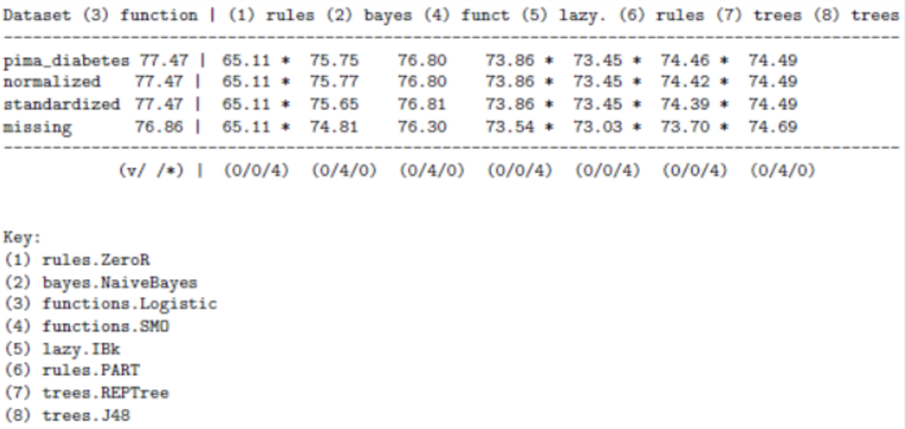

# Binary-Classification-Project
This project is an end-to-end machine learning project that deals with classification algorithms utilizing [Weka 3.8.6](https://waikato.github.io/weka-site/index.html). The first portion of the project features the `diabetes.arff` dataset and the final portion features the `heart.csv` dataset. The `diabetes.arff` dataset contains Pima Indians onset of diabetes data. The `heart.csv` dataset is also a real life heart failure prediction dataset that contains attributes of patients who may or may not suffer from heart disease. All other files are different views of the original datasets.

# Part A

## Project Goals

1.	Load the dataset.
2.	Analyze the dataset.
3.	Prepare views of the dataset.
4.	Evaluate algorithms.
5.	Finalize model and present results.

## Load the dataset

- Open the `diabetes.arff` dataset with the Weka Explorer.

<p float = "center">
  
</p>

## Analyze the dataset

**Summary Statistics**

- This dataset has 768 instances, and since the models are evaluated using 10-fold cross-validation, then each fold has 76 instances.
- There are 9 attributes, with 8 being input and 1 being output.
- For the original `diabetes.arff` dataset, the input attributes are all numerical, but have different scales. The modified files feature the normalized and standardized data.
- There are no missing values.
- The class attribute is nominal and is a two-class or binary classification problem because it has two output values.
- The class attribute is also unbalanced because there is one *positive* outcome to 1.8 *negative* outcomes. There are nearly double the number of cases that are negative.

**Attribute Distributions**

<p float = "center">
  
</p>

- There is a lot of overlap between the classes across the attribute values. This suggests that the classes are not easily separated.
- The class imbalance becomes evident when graphed (blue - tested_negative, red - tested_positive).
- Attributes plas, pres, skin, and mass have a Gaussian-like distribution.

**Attribute Interactions**

<p float = "center">
  
</p>

- In general, there is poor separation between the classes on the scatter plots.
- It would be beneficial to transform the data and create multiple views by normalizing and standardizing.


## Prepare Views of the Dataset
By creating varied views of the data, it will become clear which views are generally better at exposing the structure of the classification problem. I will create 3 additional views of the data, with each view of the dataset being created from the original.

**Normalized View**

This is the first view and includes all attributes and normalizes to fit in the range [0,1]. Generally, this benefits algorithms that are influenced by the scale of the attributes, such as instance-based or regression methods.

<p float = "center">
  
</p>

**Standardized View**

As I discussed in the Attribute Distributions section, some of the attributes have a Gaussian-like distribution. The data can be rescaled and the Gaussian-like distribution can be taken into account by using a standardized filter. The standardized view will create a copy of the original dataset named `diabetes-standardize.arff`, but each attribute will have a mean value of 0 and a standard deviation of 1. This view benefits algorithms that assume a Gaussian distribution in the input variables, such as Logistic Regression and Naive Bayes.

<p float = "center">
  
</p>

**Missing Data**

Although there are no missing values in the original dataset, some of the attributes had bad or missing data that was marked with 0 values. The new view of the data labeled `diabetes-missing.arff` creates a copy of the original dataset with the missing data marked and then imputed with an average value for each attribute.

<p float = "center">
  
</p>

## Evaluate Algorithms

Now I will design an experiment to assess the suite of standard classification algorithms across the different views of the problem using the Weka Experimenter. The following datasets were used:

```bash
- `diabetes.arff`
- `diabetes-normalize.arff`
- `diabetes-standardize.arff`
- `diabetes-missing.arff`
```

The following 8 classification algorithms were used:

```bash
- rules.ZeroR
- bayes.NaiveBayes
- functions.Logistic
- functions.SMO
- lazy.IBk
- rules.PART
- trees.REPTree
- trees.J48
```
For the first experiment, I changed KNN for IBk to 3. After running the experiment and performing the test, the pairwise-test results for ZeroR are produced:

<p float = "center">
  
</p>

Compared to ZeroR, all the algorithms are skillful on all of the views of the dataset. The baseline for skill is 65.11% accuracy. The view of the dataset with missing values imputed resulted in lower model accuracy in general. There is little variation between the standardized and normalized results when compared to the raw results, suggesting that the raw dataset will be sufficient. Finally, it appears that Logistic regression achieved higher accuracy results, but we can further determine if the difference is significant.

To do this, I set Logistic regression as the test base and then reran the analysis:

<p float = "center">
  
</p>

The base dataset and the normalized and standardized datasets are almost identical and in some instances are just a few hundredths off from each other. The dataset where missing values were replaced had the lowest overall classification accuracy rate. Since there is little difference between the base, normalized, and standardized datasets, it would be alright to use the raw dataset. The baseline for skill is 77.47% except for the dataset with missing values replaced and all algorithms were compared to Logistic and were not as effective.

Compared to the logistic regression model, ZeroR, IBk, PART, and REPTree produced results that were statistically worse. NaiveBayes, SMO, and J48 produced results that were statistically the same. No model produced results that were statistically better.

To produce a final result that will best describe the model I opted to show standard deviations and only the results for the logistic regression algorithm:

<p float = "center">
  
</p>

The results show that the estimated accuracy of the model on unseen data is 77.47% with a standard deviation of 4.39%.

## Finalze the Model and Present the Results

Next, I will create a final version of the model trained on all of the training data and save it to a file. The steps are:

1. Load `diabetes.arff`.
2. Choose the Classify tab and select the Logistic regression algorithm.
3. Under Test options, select "Use training set".
4. Click start to create the finalized model.
5. Right-click in the Result list and select Save model.

This model can be loaded and used to make predictions on new data. The model should have accuracy between 68.96% and 86.25%.

# Part B


